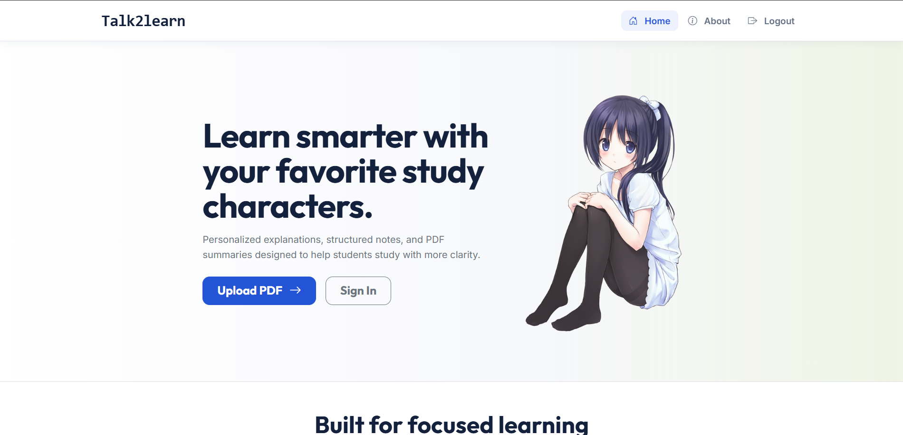

# Persona AI

Persona AI is an AI-powered learning platform that transforms PDFs into interactive learning experiences.

Users can upload documents, generate summaries, and ask questions to an AI that understands the document's content. The platform combines document processing, conversational AI, and real-time streaming to make learning more engaging and efficient.

---

## Screenshot



---

## Features

- PDF upload and analysis
- AI-generated document summaries
- Context-aware document chat
- Real-time streaming responses
- JWT-based authentication
- Redis-powered conversation memory
- Responsive and intuitive interface

---

## Tech Stack

### Frontend
- Vue 3
- Pinia
- Bootstrap
- Markdown Rendering

### Backend
- Flask
- JWT Authentication
- Redis
- PostgreSQL
- OpenRouter API

### Other Tools
- Git & GitHub
- PDF.js

---

## Why I Built This

While studying, I often found myself switching between PDFs, notes, and AI tools to understand concepts. I wanted a single place where I could upload a document, get a quick summary, and ask follow-up questions without repeatedly providing context.

Persona AI was my attempt to solve that problem.

Building it helped me learn about:

- Full-stack application architecture
- AI API integration
- Real-time response streaming
- State management in Vue
- Authentication and authorization
- Context management using Redis

---

## How It Works

1. Upload a PDF document.
2. The document text is extracted and processed.
3. An AI-generated summary is created.
4. Users can ask questions about the document.
5. The AI responds using the document context, allowing a more focused and meaningful conversation.

---

## Project Highlights

- Implemented streaming AI responses for a smoother chat experience.
- Built document-specific conversation memory using Redis.
- Created a complete authentication flow using JWT.
- Designed a responsive and intuitive user interface with Vue 3.
- Added token usage tracking and user-level limits.

---

## Installation

### Clone the Repository

```bash
git clone https://github.com/withhloveee/persona-ai-app.git
cd persona-ai-app
```

### Backend

```bash
cd backend
pip install -r requirements.txt
python run.py
```

### Frontend

```bash
cd frontend
npm install
npm run dev
```

---

## Future Improvements

- Multi-document conversations
- Vector search and RAG support
- Document collections and folders
- AI-generated flashcards
- Study plans and quizzes
- Advanced analytics

---
